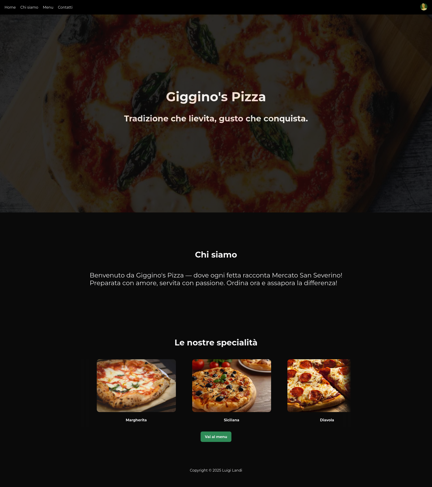
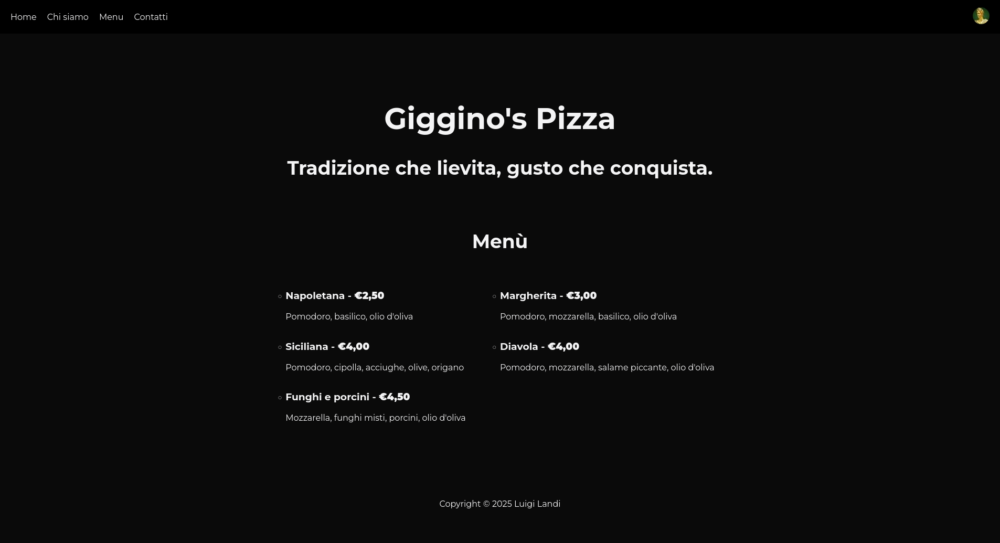
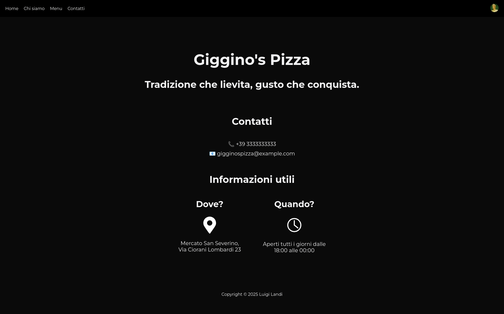

# Esercitazione HTML - Pagina web pizzeria

Creare una pagina web per una pizzeria immaginaria utilizzando i tag HTML fondamentali (e 
 per i layout) e fogli di stile CSS.

## Sito realizzato

**Nome**: Giggino's Pizza
**Slogan**: Tradizione che lievita, gusto che conquista.

### Screenshots

#### Homepage

#### Menu

#### Contacts

